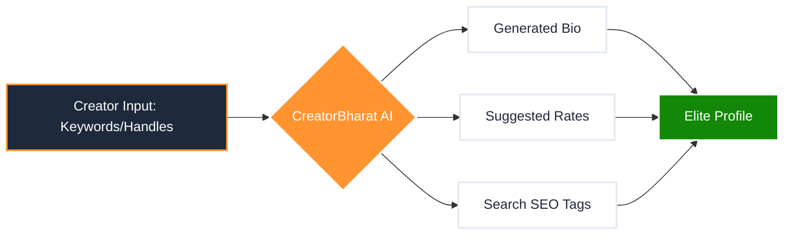

# 🤖 CreatorBharat: AI-Enhanced Profile Builder Strategy

Bhai, AI integration se hum Creator ko **"Instant Elite"** bana sakte hain. Builder ko boring form ki jagah ek "Smart Assistant" banate hain jo creator ke liye sara mushkil kaam karega.

---

## 1. AI Assistant: 4 Key Features

Hum ye 4 AI tools integrate karenge jo Wizard ke har step par help karenge:

### A. AI Bio & Story Architect (Step 1 & 3)
*   **Problem:** Creator ko bio likhne me mushkil hoti hai.
*   **AI Solution:** Creator bas 3-4 keywords dega (e.g., "Travel, Vlog, Rajasthan"), aur AI unke liye ek **High-Converting Bio** aur puri **"My Story"** generate kar dega jo brands ko impress kare.

### B. AI Intelligence Auditor (Step 2)
*   **Problem:** Fake engagement aur trust ki kami.
*   **AI Solution:** AI follower count aur engagement ko audit karega aur creator ko batayega: *"Bhai, aapka engagement rate 4.2% hai, ye brands ke liye bohot acha hai!"* Isse creator ka confidence badhega.

### C. AI Pricing Strategist (Step 6)
*   **Problem:** Creator ko nahi pata kitna charge karna chahiye.
*   **AI Solution:** Follower count aur niche ke hisab se AI suggest karega: *"Aapki profile ke hisab se ₹15,000 per Reel ek elite rate hai."* Isse negotiation easy ho jayegi.

### D. AI Auto-Tagging (Step 5)
*   **Problem:** Gallery images ko search-friendly banana.
*   **AI Solution:** Jaise hi creator photo upload karega, AI use "Tag" kar dega (e.g., #Luxury, #Outdoor, #ProductShot) taaki brands jab Marketplace me search karein toh wo photo turant dikhe.

---

## 2. AI Wizard Flow (n8n Style)

---

## 3. UI Implementation: "The Magic Pencil" 🪄

Hum har field ke side me ek **"AI Magic"** button denge:
1.  **Bio Field:** "✨ Generate with AI"
2.  **Story Field:** "✨ Write my Story"
3.  **Pricing:** "✨ Recommend Elite Rates"

Isse creator ko sirf **"Approve"** click karna hoga, likhna nahi padega.

---

## 4. Execution Plan (AI Integration)

1.  **Frontend Interface:** AI buttons aur loading animations (Sparkle effect) add karna.
2.  **AI Prompting:** Hum backend me specialized prompts likhenge (e.g., "Write a professional influencer bio for a tech creator in Bharat").
3.  **API Hook:** OpenAI ya Anthropic API ko securely connect karna.

**Bhai, ye feature CreatorBharat ko kisi bhi normal marketplace se 10x aage le jayega.**

Kya main **Step 1 (AI Bio Generator UI)** ke sath shuru karun?
