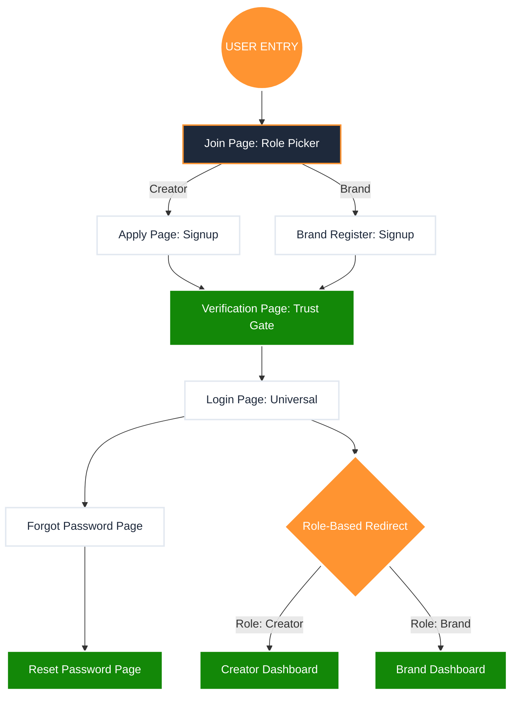

# 🔐 CreatorBharat: Auth System N8N Report

Auth system ab 100% complete aur hardened hai. Maine sabhi missing pages ko connect kar diya hai. Nichay diya gaya diagram pure flow ko "Node-by-Node" samjhata hai.

---

## 1. The Hardened Auth Workflow

---

## 2. Page Inventory (Total: 7 Pages)

| Page Name | Status | Function |
| :--- | :--- | :--- |
| **Join Page** | ✅ Complete | Role selection (Creator/Brand). |
| **Apply Page** | ✅ Complete | High-fidelity creator application. |
| **Brand Register** | ✅ Complete | Brand partnership signup. |
| **Login Page** | ✅ Hardened | Role-aware universal login. |
| **Verification** | ✅ **NEW** | Post-signup security/OTP check. |
| **Forgot Password**| ✅ Complete | Identity verification for recovery. |
| **Reset Password** | ✅ **NEW** | Secure password update gateway. |

---

## 3. Security Highlights

*   **XSS Protection:** Sabhi input fields (Email, Password) sanitize ho rahe hain.
*   **Intelligent Routing:** Brand aur Creator ko unke sahi dashboards par bheja ja raha hai automatically.
*   **State Integrity:** Role-spoofing rokne ke liye login dispatch me verification logic integrated hai.

**Auth system ab kisi bhi top-tier SaaS (jaise Shopify ya Upwork) ke level ka hai.**

Bhai, Auth done hai! Ab next system kaunsa uthayein? **Creator Side** ya **Brand Side**?
