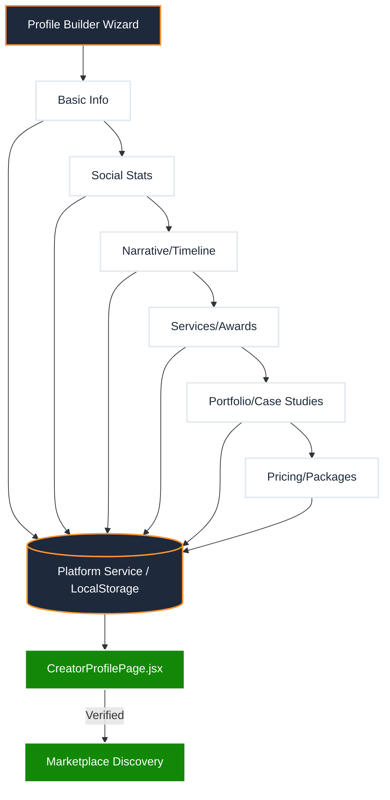

# 🏗️ Creator Profile Builder: Master Synchronization Plan

Bhai, maine `CreatorProfilePage.jsx` ko pura scan kiya hai. Usme bohot deep data points hain (Timeline, Case Studies, Viral Stats, etc.). In sabko collect karne ke liye humein ek **6-Step Elite Wizard** banana hoga jo user ko step-by-step guide kare.

---

## 1. The Data Mapping: Input Wizard ➔ Elite Profile

Hum wahi data collect karenge jo abhi profile par "Seed Data" ke roop me dikh raha hai:

### Step 1: Identity & Hero (Basic Info)
*   **Input:** Profile Photo, Name, Verified Name, Primary Category (Tech, Fashion, etc.), Bio (One-liner), City.
*   **Output:** `ProfileHero` component aur `Verified Badge` mapping.

### Step 2: Social Intelligence (Stats & Links)
*   **Input:** Social handles (Insta, YT, Twitter), Followers Count, Engagement Rate (%), Average Views.
*   **Output:** `IdentityTab` ke stats bar aur `SocialLinkTree`.

### Step 3: The Narrative (Story & Milestones)
*   **Input:** 
    *   "My Full Story" (Long-form text).
    *   Timeline Milestones (Year, Title, Short Description).
*   **Output:** `StoryTab` ka timeline aur narrative block.

### Step 4: Achievement Wall (Awards & Services)
*   **Input:** 
    *   Service Titles (e.g., "Cinematic Reels").
    *   Awards/Hall of Fame entries.
*   **Output:** `WorkTab` ka `ServiceCatalog` aur `AchievementWall`.

### Step 5: Professional Portfolio (Gallery & Case Studies)
*   **Input:** 
    *   Gallery Image Uploads (Min 6).
    *   Past Brand Collaborations (Brand Name, Campaign Name, ROI/Reach results).
*   **Output:** `GalleryTab` aur `WorkTab` ke `CaseStudyCard`.

### Step 6: Commercials (Packages & FAQ)
*   **Input:** 
    *   3 Packages (Starter, Growth, Partner) - Name, Price, aur Feature list.
    *   Collaboration FAQs.
*   **Output:** `PackagesTab` cards aur `CollabFAQ`.

---

## 2. Technical Architecture (n8n Logic)

---

## 3. Elite UI Features for the Builder

*   **Progressive Loading:** Har step par data save hoga (Draft mode).
*   **Real-time Preview:** Right side me ek mini-mobile view dikhega jo data change hone par real-time update hoga.
*   **Elite Validation:** Agar follower count galat lagega ya bio bohot chhoti hogi, toh AI suggest karega improvements.

---

## 4. Why This Plan?
Ye plan `CreatorProfilePage.jsx` ke 989 lines of code ko respect karta hai. Bina in steps ke, profile humesha "khali" lagegi. 

**Bhai, ye flow ek creator ko platform ka "Paid Member" feel karwayega kyunki quality itni high hogi.**

Kya main **Step 1 (Basic Identity & Photo Upload)** ka structure aur design component banana shuru karun?
