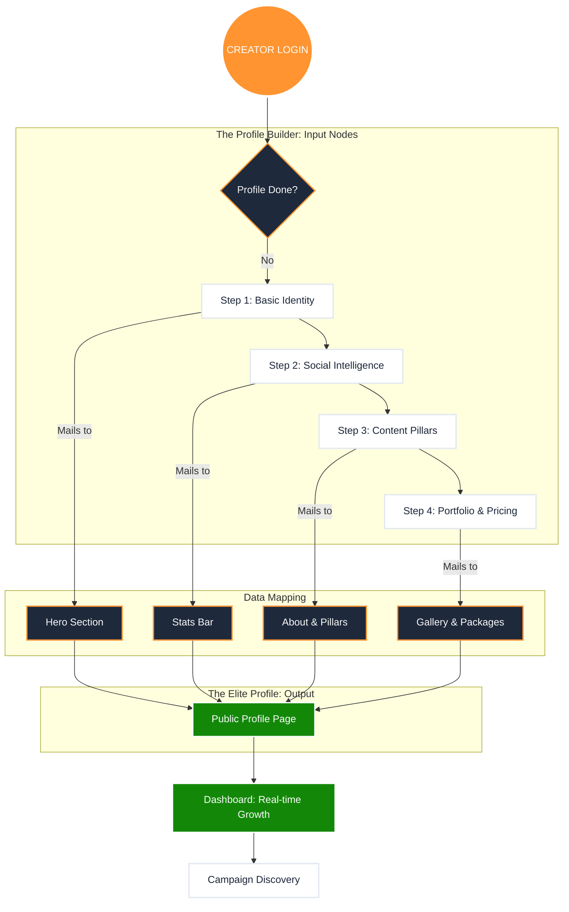

# 🎨 CreatorBharat: The Creator Elite Flow Plan

Ye plan specifically Creator side ko target karta hai. Iska main goal hai **"Data Collection to Professional Display"**. Jo data hum `CreatorProfilePage` par dikhate hain, ye Wizard wahi data step-by-step collect karega.

---

## 1. The Creator Data Pipeline (n8n Style)

---

## 2. Step-by-Step Data Mapping (Input vs Output)

Hum wahi data mangenge jo profile par dikhana hai:

| Wizard Step | Data Points (Input) | Corresponding Profile Section (Output) |
| :--- | :--- | :--- |
| **Step 1: Identity** | Name, Profile Picture, Bio, Location, Category. | **Hero Section:** Profile Header & Verification Badge. |
| **Step 2: Socials** | Followers (Insta/YT), Engagement Rate, Avg Views. | **Stats Bar:** Dynamic engagement metrics. |
| **Step 3: Strategy** | Content Pillars (e.g., Fashion, Travel), About Me Story. | **Identity Tab:** "What I Do" & "My Story" sections. |
| **Step 4: Media/Price** | Gallery Images, Package Rates (Story, Reel, Video). | **Work & Packages Tabs:** Portfolio & Collaboration fees. |

---

## 3. High-Fidelity Features for Creator Side

1.  **The "Elite Score" Generator:** 
    *   Jab creator apna data fill karega, backend automatically ek **Trust Score** generate karega based on their social numbers and profile completeness.
2.  **Live Preview Toggle:**
    *   Wizard ke side me ek small "Mobile Preview" chalega, jisse creator dekh sakega ki unki profile real-time me kaisi dikh rahi hai.
3.  **Auto-Save Draft:**
    *   Agar creator beech me chhod de, toh data save rahega taaki wo baad me continue kar sakein.

---

## 4. Execution Strategy

Hum ise aise build karenge:
1.  **Component Build:** `ProfileBuilder.jsx` name se ek multi-step modal ya page.
2.  **State Management:** `context.jsx` me temporary profile data store karna.
3.  **Validation:** Har step par check karna ki data "Elite" quality ka hai ya nahi.

**Bhai, ye flow creator ko feel karwayega ki wo kisi premium agency me register ho raha hai.**

Kya main **Step 1 (Identity & Niche)** ke UI components design karna shuru karun?
