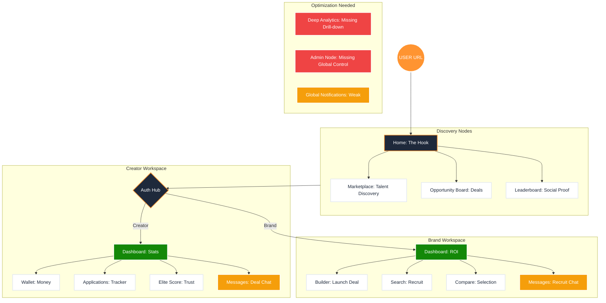

# 🗺️ CreatorBharat: Elite Frontend Strategy Map (n8n Style)

Ye report aapke pure frontend ecosystem ka "Strategic Flow" dikhati hai. Isme humne connect kiya hai ki user kahan se enter hota hai aur kahan ja kar rukta hai, aur kya-kya missing hai.

---

## 1. The Global Ecosystem Diagram

Is diagram me har "Node" ek page ya logic unit hai.

---

## 2. Weak & Missing Nodes Analysis (Kahan kaam baki hai?)

### 🔴 Missing Nodes (Jo abhi bilkul nahi hain):
1.  **Admin Control Node:** Ek global dashboard jahan se aap users ko ban/verify kar saken aur analytics dekh saken.
2.  **Detailed ROI Node (Brand):** Brand ko ye dikhana ki unka kitna paisa kharch hua aur kitne clicks mile (Graph-heavy page).
3.  **Global Notification Hub:** Ek centralized bell icon jahan Creator aur Brand dono ko deal updates milein.

### 🟡 Weak Nodes (Jo hain, par "Elite" nahi hain):
1.  **Messaging Hub:** Chat abhi basic hai. Ise WebSocket ke sath "Real-time" aur "Secure" banana hoga (Data theft rokne ke liye chat me links block karne ka logic).
2.  **Analytics Nodes:** Dashboards me abhi sirf general stats hain. Inhe interactive charts (D3.js ya Recharts) me convert karna baki hai.

---

## 3. The 4-Week Execution Plan (Next Steps)

Aapko is sequence me aage badhna chahiye:

### Week 1: "The Voice" (Real-time Messaging)
*   **Goal:** `MessagesPage` ko real-time banana.
*   **Action:** Firebase ya Socket.io integrate karna taaki brands aur creators turant baat kar saken.

### Week 2: "The Brain" (Deep Analytics)
*   **Goal:** Dashboards me data visualization add karna.
*   **Action:** Recharts implement karke income trends aur engagement graphs banana.

### Week 3: "The Eye" (Notification System)
*   **Goal:** Har action (New Deal, Payment, Message) ke liye alert dena.
*   **Action:** Centralized notification server-side logic aur frontend bell icon dropdown.

### Week 4: "The Hand" (Admin Panel & Governance)
*   **Goal:** Pure platform par aapka control.
*   **Action:** Ek Admin role banana aur backend se pure platform ka data manage karna.

---

## 🚀 Final Recommendation
Abhi hamara **Security aur Stability** solid ho gaya hai. Ab aapka focus **"User Engagement"** (Chat & Notifications) aur **"Data Insight"** (Analytics) par hona chahiye. 

**"SaaS tab banti hai jab user app ke andar daily kuch action le (like Chat or Check Stats)."**

Aap kahan se shuru karna chahenge? Kya main **Messages Page** ko elite level par polish karun?
