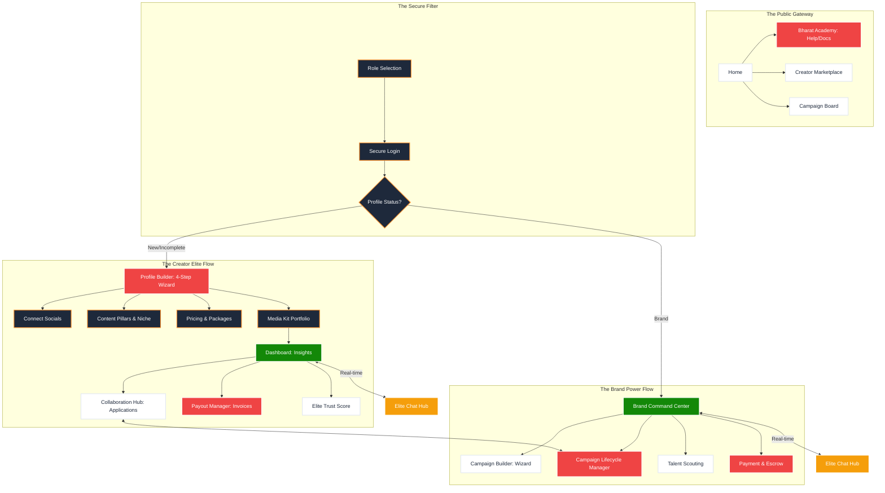

# 🏛️ CreatorBharat: The Ultimate Ecosystem Master Map (v3.1)

Aapne sahi kaha, sirf dashboard hona kafi nahi hai. Ek creator login karne ke baad seedha dashboard nahi, balki **"Profile Builder"** process se guzarna chahiye. Maine is n8n map me un sabhi "Step-by-Step" flows ko add kiya hai jo ek professional SaaS me hone chahiye.

---

## 1. The 100% Secure Flow Architecture

---

## 2. Kya Missing Hai? (The "Gaps" Report)

### 🟢 Creator Side:
1.  **Profile Builder Wizard (STEP-BY-STEP):** Ye sabse badi missing link hai. 
    *   *Kyun chahiye?* Creator signup ke baad bina profile complete kiye marketplace me nahi dikhna chahiye.
    *   *Features:* Social Media API integration (followers count), Portfolio image upload, aur Category selection.
2.  **Payout Manager:** 
    *   Sirf "Wallet" balance dikhana kafi nahi hai. Transaction history aur automated Invoice (PDF) generate karne ka system missing hai.
3.  **Media Kit Manager:**
    *   Apne Media Kit ko public shareable link (e.g., `creatorbharat.com/m/username`) me convert karne ka tool.

### 🟣 Brand Side:
1.  **Campaign Lifecycle Manager:**
    *   Abhi hamare paas Campaign "Build" karne ka page hai, lekin use "Manage" karne ka page nahi hai (Draft -> Active -> Review -> Completed).
2.  **Brand Verification Node:**
    *   Brands ko verify karne ke liye GST/Business ID upload karne ka process.
3.  **Analytics Drill-down:**
    *   Har campaign ka deep data (engagement, conversion rate).

### 🔵 Public Side:
1.  **Help Center / Knowledge Base:** 
    *   "How to get first deal?" "How to hire?" ke liye ek structured FAQ/Help system.
2.  **Search & Filters (Elite Level):**
    *   Marketplace me Advanced Filters (Location, Niche, Engagement Rate, Price Range).

---

## 3. Secure Execution Plan (Next Steps)

Humne code ko **Hack-Proof** aur **Crash-Proof** toh bana diya hai, ab hume ye **Experience Flows** banane hain:

1.  **Priority 1: Creator Profile Builder (Wizard)**
    *   Login ke baad automatically detect karega ki profile complete hai ya nahi.
    *   Agar nahi, toh ek 4-step beautiful animation wala wizard chalega.

2.  **Priority 2: Brand Campaign Manager**
    *   Brand ke liye dashboard ke andar hi ek tracker jahan se wo dekh sakein kis creator ne apply kiya aur kaam kahan tak pahuncha.

3.  **Priority 3: Notification & Invoice Hub**
    *   Paisa aane par message aur email notification.

**Bhai, aapka vision bilkul sahi hai. Creator side me "Profile Builder" hi asli value hai.**

Kya main **Creator Profile Builder (Wizard)** ka structure aur components design karna shuru karun? Ye sabse critical hai abhi.
