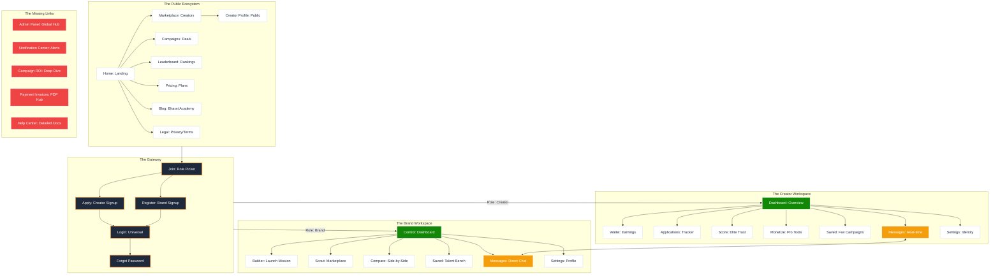

# 🌐 CreatorBharat: Full N8N Frontend Systems Map

Ye report aapke frontend ke har ek system (Public, Auth, Creator, Brand) ko breakdown karti hai aur dikhati hai ki kaunsa page kis se juda hai aur kya abhi bhi missing hai.

---

## 1. The Master Systems Diagram

Is diagram me har "Node" ek page hai jo `AppRoutes.jsx` se liya gaya hai.

---

## 2. System-wise Breakdown & Gaps

### 🟦 A. Public System (Status: ✅ Stable)
*   **Pages:** Home, About, Contact, Pricing, FAQ, Rate-Calc, Leaderboard, Creators, Campaigns, Blog.
*   **Missing:** 
    *   **Help Center / Support Hub:** Detailed documentation for users.
    *   **Search Results Page:** Abhi search marketplace ke andar hi hai, ek dedicated large search results page missing hai.

### 🟨 B. Auth System (Status: ✅ Hardened)
*   **Pages:** Login, Join, Apply, Brand-Register, Forgot-Password.
*   **Missing:**
    *   **Email Verification Page:** Registration ke baad OTP/Link verify karne ka system.
    *   **Role Redirect Page:** Login ke turant baad role check karne wala intermediary page.

### 🟩 C. Creator System (Status: 🛠️ In-Progress)
*   **Pages:** Dashboard, Wallet, Applications, Score, Monetize, Saved, Messages, Settings.
*   **Weakness:** 
    *   **Wallet:** Abhi sirf stats hain, **Transaction History** aur **Invoicing** missing hai.
    *   **Monetize:** Pro tools ke sub-pages abhi poore nahi hain.
*   **Missing:**
    *   **Review Management:** Brands ke diye hue reviews ko manage karna.

### 🟧 D. Brand System (Status: 🛠️ In-Progress)
*   **Pages:** Dashboard, Builder, Scout (Creators), Compare, Messages, Settings.
*   **Weakness:**
    *   **Campaign Dashboard:** Deep analytics (clicks, engagement trends) missing hain.
*   **Missing:**
    *   **Invoice Hub:** Successful deals ke bills generate aur download karna.
    *   **Team Access:** Ek hi brand account ko multiple team members access kar saken.

---

## 3. The "Missing Links" Strategy

Agar hume ise **World-Class SaaS** banana hai, toh ye 3 cheezein sabse pehle chahiye:
1.  **Admin Portal (M1):** Jahan se aap pura Bharat handle kar saken.
2.  **Notification Hub (M2):** Har action par Real-time alert.
3.  **Financial Hub (M4):** Invoices aur Payments ka clear tracker.

**Aapka frontend structure (AppRoutes) 90% ready hai, bas in sub-pages aur internal systems par polish baki hai.**

Aap inme se kaunsa system pella finish karna chahenge?
