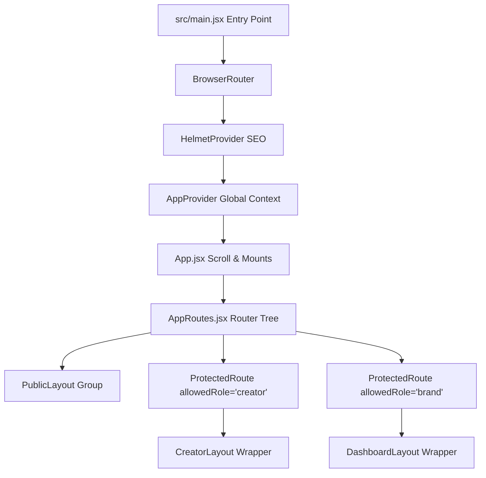

# 📖 CreatorBharat V3 — Developer Collaboration Guide

Welcome to the **CreatorBharat V3** engineering guide. This document is designed to help new developers understand the core technical architecture, data structures, and lifecycle patterns of the platform, enabling seamless collaboration and feature extensions.

---

## 🚀 1. Architectural Architecture Overview

CreatorBharat is built as a highly responsive client-side Single Page Application (SPA) utilizing Vite, React 18, React Router v7, and custom CSS styling.



---

## 📦 2. Global State Management (`src/core/context.jsx`)

Global application state is managed using React Context and `useReducer`. 

### Initial State (`IS`) Schema
```javascript
export const IS = {
  page: 'home',             // Active page ID
  sel: { 
    creator: null,          // Currently viewed creator ID
    campaign: null          // Currently viewed campaign ID
  },
  user: null,               // Logged-in user record (JSON parsed)
  role: null,               // Active role ('creator', 'brand', 'admin', 'guest')
  isPro: false,             // Subscription tier status
  saved: [],                // Bookmark creator IDs
  compared: [],             // Array of up to 3 creator IDs for comparison
  applied: [],              // Campaign IDs the creator has applied to
  follows: [],              // Creator/brand IDs followed by the user
  toasts: [],               // Active toast notifications stack
  ui: { 
    mobileMenu: false,      // Mobile navigation drawer toggle
    hideNav: false          // Toggle navbar visibility (e.g. in full-screen maps)
  },
  cf: { ... },              // Creator filter settings (search query, platform, niche)
  cpf: { ... }              // Campaign filter settings
};
```

### Key Reducer Dispatches (`dsp`)
- `dsp({ t: 'LOGIN', u: userObj, role: 'creator'|'brand' })` — Authenticates session, sets role, and updates state.
- `dsp({ t: 'LOGOUT' })` — Wipes out auth state and bookmarks from `localStorage` and returns to homepage.
- `dsp({ t: 'SESSION_EXPIRED' })` — Wipes session variables and routes user back to `/login`.
- `dsp({ t: 'TOAST', d: { type: 'success'|'error'|'warn', msg: 'Message' } })` — Pushes dynamic notice to toast layer.
- `dsp({ t: 'FOLLOW', id })` / `dsp({ t: 'SAVE', id })` — Handles toggle states.

---

## 🔒 3. Routing & Security Guards (`src/core/ProtectedRoute.jsx`)

Private dashboards are locked behind `<ProtectedRoute allowedRole="...">`.

- **Access Denied (Not logged in)**: User is redirected to `/login`.
- **Role Mismatch**: If a creator attempts to access a brand dashboard (`/brand-dashboard`), the guard redirects them back to `/creator/dashboard` (and vice-versa).
- **Silent Route Redirection**: Direct maps are configured in `AppRoutes.jsx` to map older legacy routes (e.g., `/dashboard` redirects to `/creator/dashboard`) to the isolated namespaces.

---

## 🌐 4. Data Services & Offline Database Fallbacks

To ensure the client remains 100% functional even when backend servers (deployed on Render free tiers) are sleeping or offline, custom services trap API failures.

### The `apiCall` Wrapper (`src/utils/api.js`)
- Houses an automated **exponential retry loop** (up to 2 retries) on network failure or rate limit (HTTP 429) conditions.
- Listens to HTTP 401 statuses globally and dispatches `SESSION_EXPIRED` to prevent session desynchronization.

### Local Database Interceptors (`src/utils/platformService.js`)
When saving profile changes (e.g. Rate cards, bios, verification uploads):
1. The app first tries to write to the REST backend API (`/creators/profile`).
2. If the API fails or times out, the service catches the error, dispatches an amber toast, and falls back to **client-side memory and localStorage variables (`cb_creators` / `cb_user`)**.
3. All dashboard statistics, profiles, and state indicators read from these fallbacks, allowing the onboarding stepper and verification pipelines to work flawlessly.

---

## 🎨 5. Styling Guidelines & Primitives

CreatorBharat relies on customized CSS definitions in `src/index.css` paired with a set of visual primitive components.

### Primitive UI Components (`src/components/common/Primitives.jsx`)
Always use these pre-styled primitives to maintain design consistency:
- **`<Btn>`**: High-performance button supporting presets: `.btn-primary`, `.btn-primary-pill`, `.btn-glass`, `.btn-dark`.
- **`<Bdg>`**: Glassmorphic tag/badge for categories.
- **`<Fld>`**: Standardized form input field with floating label animations.
- **`<Card>`**: Saffron-bordered container card with smooth transitions.

---

## 🚀 6. Step-by-Step: Adding a New Page

When introducing a new view to the SaaS ecosystem, follow this exact workflow:

### Step 1: Create the Component
Create your page inside `src/pages/<subfolder>/` (e.g., `src/pages/creator/AnalyticsReportPage.jsx`). Ensure you export a default component.

### Step 2: Declare Lazy Import in `AppRoutes.jsx`
Open `src/AppRoutes.jsx` and import the page using React Lazy at the top:
```javascript
const AnalyticsReportPage = lazy(() => import('./pages/creator/AnalyticsReportPage'));
```

### Step 3: Register Route in Layout Group
Add the route under the appropriate protection/layout block:
```jsx
{/* Inside Creator Ecosystem Layout Group */}
<Route element={<ProtectedRoute allowedRole="creator"><CreatorLayout><Outlet /></CreatorLayout></ProtectedRoute>}>
  ...
  <Route path="/creator/analytics-report" element={<AnalyticsReportPage />} />
</Route>
```

### Step 4: Add Navigation Link
Go to `src/components/layout/CreatorLayout.jsx` or the Sidebar navigation menu, and add the new route to the menu items array:
```javascript
{ path: '/creator/analytics-report', label: 'Analytics Report', icon: ChartPieIcon }
```
