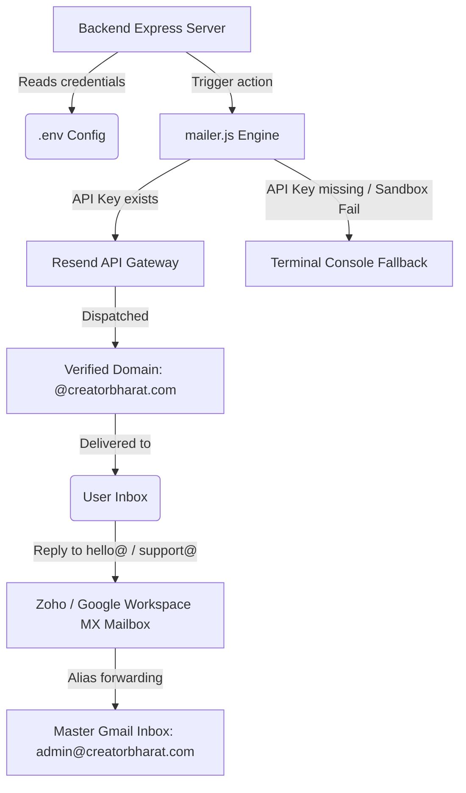

# 🇮🇳 CreatorBharat V3 — Production Email Integration & Domain Setup Guide

Yeh guide CreatorBharat SaaS platform ke automatic emails, domain verification (Resend SDK), aur inbound mail aliases (Zoho Mail / Google Workspace) ko set up aur manage karne ke liye hai.

---

## 📈 System Architecture Overview

---

## 📨 1. Current Code Implementation

* **Engine Location**: [mailer.js](file:///d:/creatorbharat-1/creatorbharat-backend/src/utils/mailer.js)
* **Configuration variables (.env)**:
  * `RESEND_API_KEY`: Aapki unique Resend key.
  * `EMAIL_FROM`: `"hello@creatorbharat.com"` (Outgoing sender address).
  * `FRONTEND_URL`: `"http://localhost:5173"` (Vite frontend redirection).

### Auto Sandbox Fallback logic:
Agar local environment me API key nahi milta, ya fir agar aap sandbox mode me kisi unverified email par test bhejte hain, toh system crash nahi hoga. **Pura HTML email content styled formatting me terminal logs me print ho jayega.**

---

## 🌐 2. Domain Verification on Resend (Outbound)

Emails ko `hello@creatorbharat.com` se real inboxes me deliver karne ke liye aapko **DKIM** aur **SPF** records apne Domain Registrar (Hostinger, GoDaddy, or Cloudflare) ke DNS settings me add karne honge.

### Step-by-Step DNS Setup:
1. **Resend Dashboard** par jaakar **Domains** section me **Add Domain** par click karein.
2. Apne domain name ko enter karein: `creatorbharat.com`.
3. Resend aapko **3 CNAME Records** aur **1 TXT Record** provide karein.
4. Apne Domain Control Panel (DNS Manager) me jaakar in records ko add karein:

| Type | Host/Name | Value/Points To | TTL |
| :--- | :--- | :--- | :--- |
| **CNAME** | `resend._domainkey` | `dkim1.resend.com` | Auto / 3600 |
| **CNAME** | `resend2._domainkey` | `dkim2.resend.com` | Auto / 3600 |
| **CNAME** | `resend3._domainkey` | `dkim3.resend.com` | Auto / 3600 |
| **TXT** | `@` (or leave blank) | `v=spf1 include:spf.resend.com ~all` | Auto / 3600 |

5. DNS changes propogate hone me 10-15 mins lag sakte hain. Uske baad Resend par **Verify** click karein. Verify hote hi aap official domain name se emails bhej sakenge.

---

## 📥 3. Inbound Emails & Aliases Setup (Incoming replies)

Jab users aapke outgoing emails par **Reply** karenge, toh unhe receive karne ke liye aapko inbound routing set up karni hogi.

### Option A: Zoho Mail (Free tier for Custom Domain)
Agar aap free me custom inboxes use karna chahte hain:
1. [Zoho Mail](https://www.zoho.com/mail/) par free custom domain plan sign up karein.
2. Apne DNS Settings me Zoho ke **MX Records** add karein:

| Type | Host/Name | Value/Points To | Priority |
| :--- | :--- | :--- | :--- |
| **MX** | `@` | `mx.zoho.in` | `10` |
| **MX** | `@` | `mx2.zoho.in` | `20` |
| **MX** | `@` | `mx3.zoho.in` | `50` |

3. Zoho Mail admin console par **`admin@creatorbharat.com`** ko primary inbox banayein.

### Option B: Free Email Aliases (Multi-inbox management)
Aapko `hello@`, `support@`, `billing@` sabke liye alag-alag paid accounts lene ki zaroorat nahi hai.
1. Zoho Mail / Google Workspace Settings me **Aliases** option par jayein.
2. Naye aliases banayein:
   * `support@creatorbharat.com` -> Forward to `admin@creatorbharat.com`
   * `billing@creatorbharat.com` -> Forward to `admin@creatorbharat.com`
   * `hello@creatorbharat.com` -> Forward to `admin@creatorbharat.com`
3. Ab jab bhi koi inme se kisi bhi address par mail bhejega, wo aapke ek hi main **`admin@creatorbharat.com`** account par land karega.

---

## 🧪 4. Testing & Verification

Aap in endpoints ko check karke live flow dekh sakte hain:
1. **Onboarding Email Check**: `/api/auth/register/creator` par mock signup karke console me welcome note template check karein.
2. **Billing receipt check**: Escrow payment verify hone par (`/api/payments/verify`) invoice receipt check karein.
