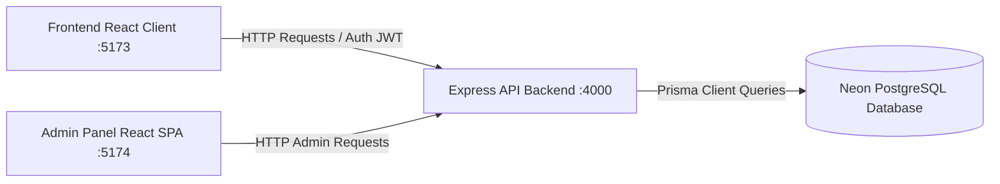

# 🌐 CreatorBharat V3 — Full-Stack SaaS System Integration Guide

This guide details the complete SaaS ecosystem of **CreatorBharat V3**, explaining how the **Frontend Client**, the **Node.js Express Backend API**, the **Prisma ORM & PostgreSQL Database**, and the **Vite Admin Panel** interact.

---

## 🏗️ 1. Complete SaaS System Architecture

The ecosystem consists of four independent layers working together:



### System Specs & Ports
- **Frontend Client:** React 18, Vite 6, PWA configuration (Port: `5173`)
- **Backend API Server:** Node.js Express, Helmet, CORS, Rate-Limiting (Port: `4000`)
- **Admin Dashboard:** React 18, Vite 5, Lucide Icons (Port: `5174`)
- **Database:** PostgreSQL hosted on Neon Tech, handled via Prisma ORM

---

## 💾 2. Accessing Legacy Backups

To ensure a clean starting point for frontend optimizations, the older backend routes and Babel-standalone admin code have been safely moved to:
- **Backend Backup:** [local_backups/creatorbharat-backend-old](file:///d:/creatorbharat-1/local_backups/creatorbharat-backend-old) (Contains full controller routes for `payments.js`, `creators.js`, `campaigns.js`, etc.)
- **Admin Panel Backup:** [local_backups/creatorbharat-admin-old](file:///d:/creatorbharat-1/local_backups/creatorbharat-admin-old) (Contains the old single-file React component `creatorBharat-admin.jsx`)

*Note: The `local_backups/` directory is 100% ignored in Git to prevent uploading any active payment keys or private database links.*

---

## 🛠️ 3. Local Development Setup

To run the entire full-stack system locally:

### Step 1: Database Setup (Neon PostgreSQL)
1. Go to your Neon console (or Supabase) and create a PostgreSQL database.
2. Copy your connection URL and paste it as `DATABASE_URL` in your backend `.env` file (see `.env.example` in [creatorbharat-backend](file:///d:/creatorbharat-1/creatorbharat-backend)).

### Step 2: Initialize Backend & Database Schema
Navigate to the backend directory and run:
```bash
cd D:\creatorbharat-1\creatorbharat-backend

# 1. Install dependencies
npm install

# 2. Push database schema to Neon / Supabase PostgreSQL
npx prisma db push

# 3. Start Express server in development mode
npm run dev
```
The backend API server will run at: **http://localhost:4000/api**

### Step 3: Run the Admin Dashboard
Open a new terminal and run:
```bash
cd D:\creatorbharat-1\creatorbharat-admin

# 1. Install dependencies
npm install

# 2. Start Admin dashboard
npm run dev
```
The Admin Panel will launch at: **http://localhost:5174/**

### Step 4: Run the Frontend App
Open a new terminal and run:
```bash
cd D:\creatorbharat-1\creator-bharat-v3

# 1. Install dependencies
npm install

# 2. Run local client server
npm run dev
```
The Frontend client will launch at: **http://localhost:5173/**

---

## 🔒 4. Security & Environment Variables

- **Secrets Handling:** Never check `.env` files into Git. Verify that both backend and admin `.gitignore` lists have `.env` and `node_modules` blocked.
- **CORS Protection:** The backend is configured to accept requests only from the frontend (`FRONTEND_URL` in `.env`). Update this setting when deploying the frontend to Vercel/Netlify.
