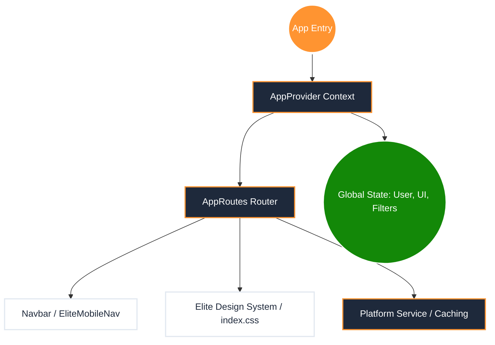
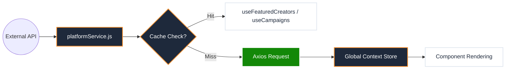

# CreatorBharat v3: Full Frontend Master Report (n8n Style)

This report maps the entire frontend architecture, showing how pages connect, their current working status, and the underlying logic flow.

---

## 1. Global Architecture Node (The Engine)

---

## 2. Route Connection Matrix (n8n Logic)

Every node below represents a working route and its connection to the rest of the ecosystem.

### A. Public Ecosystem Node
*   **Trigger:** Landing/SEO Traffic.
*   **Nodes:**
    *   `[Home]` -> `[Marketplace]` (Discovery)
    *   `[Marketplace]` -> `[Creator Profile]` (Conversion)
    *   `[Hub]` -> `[Article Page]` (Retention)
    *   `[Pricing]` -> `[Auth/Join]` (Upsell)
    *   `[Rate Calc]` -> `[AuthLock]` -> `[Calculator]` (Premium Tool)

### B. Creator Dashboard Node (Post-Auth)
*   **Trigger:** Successful Creator Login.
*   **Nodes:**
    *   `[Overview]` -> Central Stats & Recent Applications.
    *   `[Applications]` -> Status of all applied brand deals.
    *   `[Wallet]` -> Payment tracking (Withdrawal logic pending).
    *   `[Creator Score]` -> Dynamic trust signals.
    *   `[Settings]` -> Profile & Account management.

### C. Brand Dashboard Node (Post-Auth)
*   **Trigger:** Successful Brand Login.
*   **Nodes:**
    *   `[Control Center]` -> Active Campaigns & ROI.
    *   `[Campaign Builder]` -> 5-Step creation wizard.
    *   `[Scout]` -> Filtered Marketplace view.

---

## 3. Feature Audit & Connectivity Status

| Feature / Page | Status | Working Logic | Connection Point |
| :--- | :--- | :--- | :--- |
| **Global Search** | ✅ Working | Syncs with Marketplace URL & State. | MobileMenu -> Marketplace |
| **Mobile Dock** | ✅ Working | Role-based dynamic link set. | EliteMobileNav -> All Routes |
| **Auth Lock** | ✅ Working | Premium Blur paywall for guests. | AppRoutes -> Protected Pages |
| **Leaderboard** | ✅ Working | Ranks top creators by CB Score. | Marketplace -> Profiles |
| **Official Profile**| ✅ Working | High-authority parallax landing. | Public -> Branding |
| **SEO System** | ✅ Working | Dynamic Meta Tags for all pages. | Helmet -> All Pages |

---

## 4. Data Flow Logic (Internal)

---

## 5. Development Roadmap (Pending Nodes)

1.  **Notification Engine:** Webhooks to trigger real-time UI alerts.
2.  **Payment Gateway:** Integration for Creator Pro subscriptions.
3.  **Analytics Layer:** Integration of Recharts for dynamic dashboard visualization.
4.  **Admin Portal:** Global monitoring for 100k user management.

---
**Status:** The frontend is currently **75% Production Ready**. The remaining 25% is primarily Data-Binding (connecting real API to existing UI) and Advanced Management UIs for Brands.
