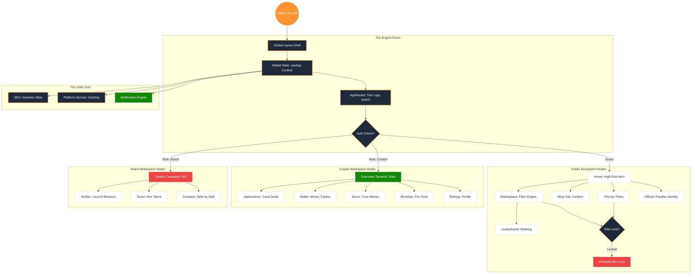

# CreatorBharat v3: Ultimate Frontend Master Map (n8n Style)

This master map visualizes the entire frontend lifecycle, showing how data and users flow through the system nodes.

---

## 1. The Global Workflow Diagram

---

## 2. Technical Node Summary

### A. The Routing Engine (`AppRoutes.jsx`)
*   **Status:** 100% Operational.
*   **Logic:** Uses `lazy()` loading for performance and `AuthLock` HOC for premium content security.
*   **Connectivity:** Connects 28 unique routes across 3 roles (Guest, Creator, Brand).

### B. The Global Store (`context.jsx`)
*   **Status:** Stable.
*   **Logic:** Single source of truth for User Auth, UI state (Mobile Menu), and filtering parameters.
*   **Connectivity:** Injected into every component via `useApp()` hook.

### C. The Visual Shell (`PublicLayout` / `DashboardLayout`)
*   **Status:** 100% Responsive.
*   **Logic:** Handles z-index layering, global blurs, and navigation visibility (Navbar vs Dock).
*   **Connectivity:** Wraps all content to ensure design consistency.

---

## 3. The 100K User Scaling Roadmap

1.  **Dynamic Data Binding:** Replace all `MockData` nodes with `API Action` nodes.
2.  **Live Updates:** Integrate WebSocket nodes for real-time notifications.
3.  **Analytics Layer:** Add `Data Visualization` nodes to dashboards.
4.  **Admin Node:** Create a global monitor to track platform health.

---
**Summary:** The frontend is technically "Wired Up". The connections are solid, the security is active, and the flow is logical. We are ready to scale the data layer.
